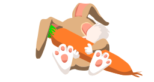

<h2 align="center">Hello, everyone! 😊</h2>
<h3 align="center">Thanks for visiting my awesome profile. I'm Marie, nice to meet you!👋👋</h3>

I'm a DMIT-Web Design and Development student who is passionate about arts 🎨, crafts ✂️, and cosplay! 👗

 
<h3>Here are the apps and programs I use. Are these familiar to you, too?</h3>

  

 
 

Did you know I drew this cute lil bunny? 

   

<h2 align="center"> More about me:</h2>

I can tell you more, but it will be irrelevant. 😆

<h3 align="right">Talk to you soon!</h3>
